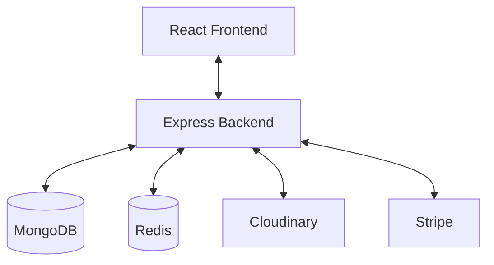
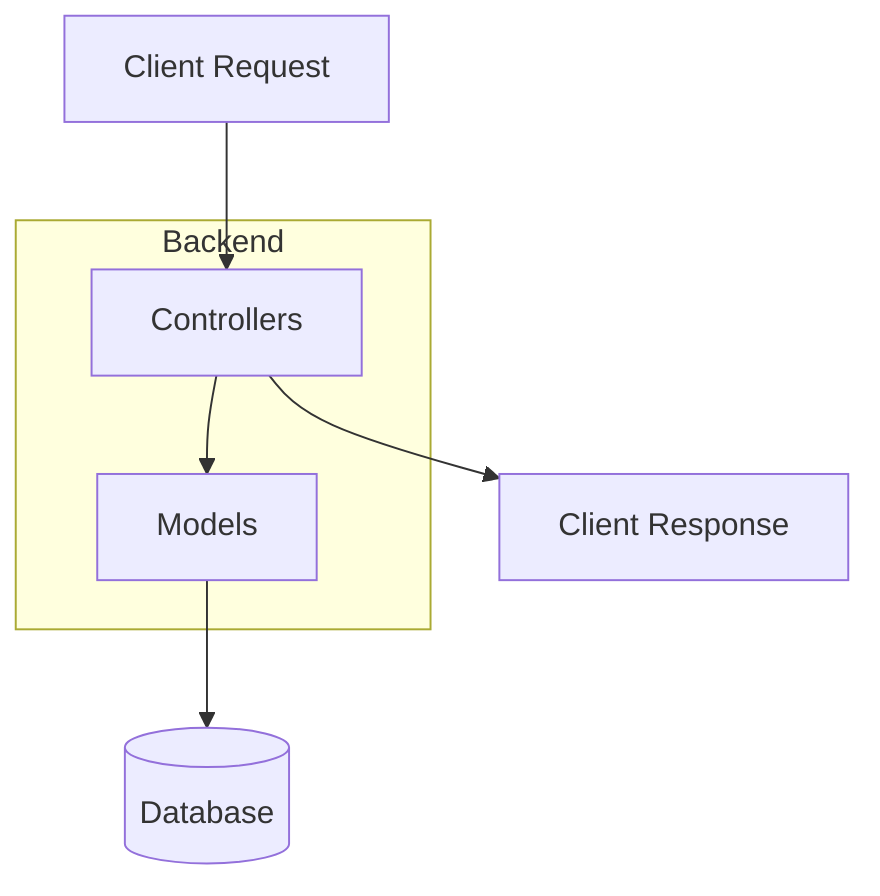
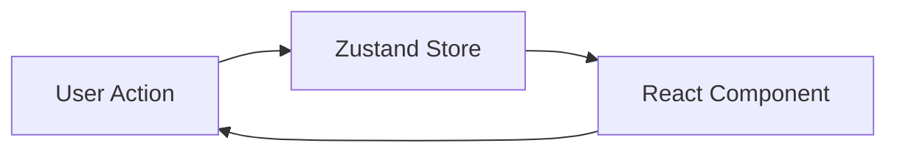
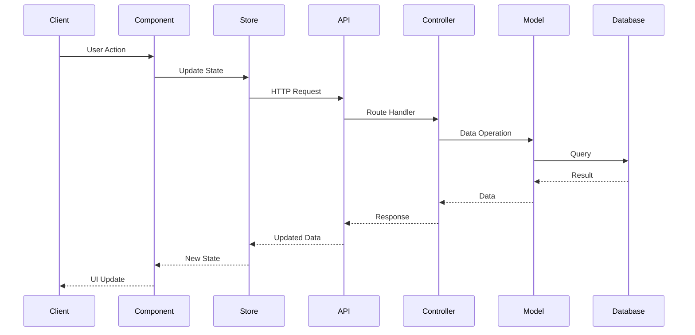
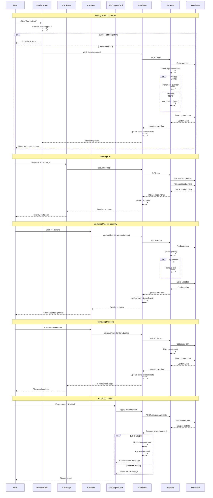
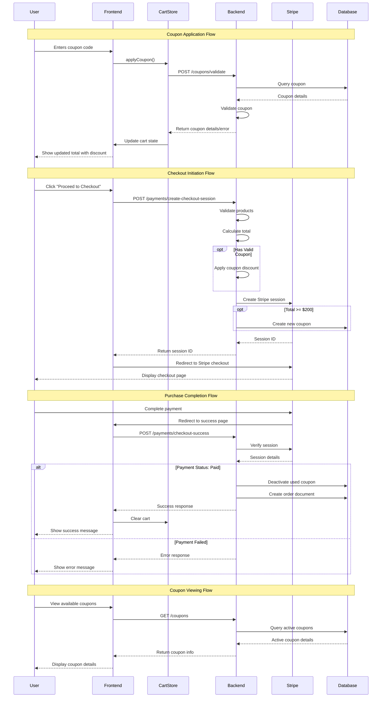
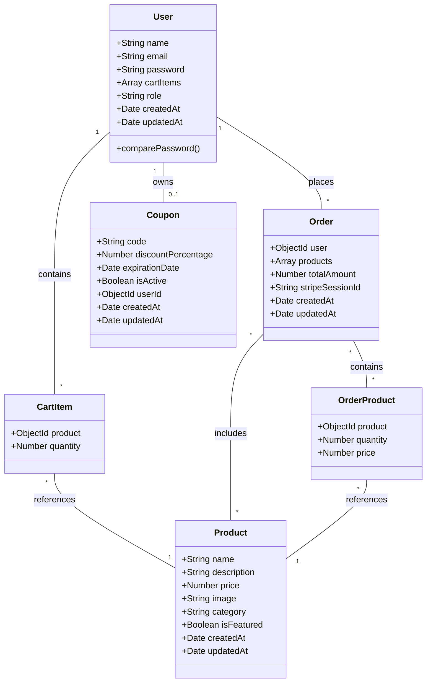

# Modern E-commerce Platform

A full-stack e-commerce store built with React.js for the frontend, Node.js and Express for the backend API, MongoDB as the database, and Redis for caching, featuring authentication, product management, shopping cart functionality, Stripe integration for payments, coupon usage, and analytics dashboards.

## 🌟 Features

- **User Authentication**
  - JWT-based authentication with access and refresh tokens
  - Secure password hashing with bcrypt
  - Role-based authorization (Admin/Customer)
  - Redis-backed token management

- **Product Management**
  - CRUD operations for products (Admin)
  - Category-based product organization
  - Featured products system (cached in Redis)
  - Image storage with Cloudinary
  - Product recommendations for upsaling

- **Shopping Experience**
  - Interactive shopping cart
  - Real-time price calculations
  - Coupon system with automatic generation
  - Secure Stripe payment integration
  - Success or cancel page, providing feedback on their transaction

- **Admin Dashboard**
  - Sales analytics with visual charts
  - Product management interface

## 🏗️ Architecture

### System Overview

The e-commerce application follows a client-server architecture. The frontend (React.js) acts as the client, making requests to the backend API (Node.js and Express). The backend API interacts with the MongoDB database and Redis cache to process requests and return data to the frontend.



### Technical Stack

#### Frontend
- **React.js** - UI framework
- **React Router Dom** - Pages navigation
- **Zustand** - State management
- **Axios** - HTTP client
- **Tailwind CSS** - Styling
- **Recharts** - Analytics visualization
- **Framer Motion** - Animations
- **Lucid React** - Icons
- **React hot toast** - Notifications
- **React confetti** - Celebratory effects

#### Backend
- **Node.js & Express** - Server framework
- **MongoDB (Atlas)** - Database
- **Mongoose** - Object Data Modeling
- **Redis (Upstash)** - Caching & token management
- **JWT** - Authentication
- **bcrypt.js** - Passwords Hashing
- **Cookie Parser** - manage cookies
- **Stripe** - Payment processing
- **Cloudinary** - Image storage


### Primary Architectural Patterns

#### 1. MVC (Model-View-Controller) Pattern in Backend
The backend follows the MVC architectural pattern with a RESTful API implementation:



##### Components:
- **Models** (`/backend/models/`)
  - Represent data structures and business logic
  - Handle database interactions
  - Examples: `user.model.js`, `product.model.js`

- **Controllers** (`/backend/controllers/`)
  - Handle request/response logic
  - Process business operations
  - Examples: `auth.controller.js`, `product.controller.js`

- **Routes** (`/backend/routes/`)
  - Define API endpoints
  - Map URLs to controller functions
  - Examples: `auth.route.js`, `product.route.js`

#### 2. Flux-like Pattern in Frontend (using Zustand)
The frontend implements a Flux-like pattern through Zustand stores:



##### Components:
- **Stores** (`/frontend/src/stores/`)
  - Central state management
  - Handle state updates
  - Examples: `useCartStore.js`, `useProductStore.js`

- **Components** (`/frontend/src/components/`)
  - Presentation logic
  - User interaction handlers
  - Examples: `ProductCard.jsx`, `CartItem.jsx`

- **Pages** (`/frontend/src/pages/`)
  - Route-level components
  - Compose multiple components
  - Examples: `HomePage.jsx`, `CartPage.jsx`

### Secondary Design Patterns

#### 1. Repository Pattern
Implemented through Mongoose models:
```javascript
// Example from product.model.js
const productSchema = new mongoose.Schema({
    name: String,
    price: Number,
    // ...
});
```

#### 2. Middleware Pattern
Used for cross-cutting concerns:
```javascript
// Example from auth.middleware.js
const protectRoute = async (req, res, next) => {
    // Authentication logic
    next();
};
```

### REST API Design

The API follows REST principles:

#### 1. Resource Naming
- Uses nouns for resources
- Follows hierarchical structure
```
/products              # Product collection
/products/:id          # Single product
```

#### 2. HTTP Methods
- GET: Retrieve resources
- POST: Create resources
- PUT/PATCH: Update resources
- DELETE: Remove resources

#### 3. Status Codes
- 200: Success
- 201: Created
- 400: Bad Request
- 401: Unauthorized
- 403: Forbidden
- 404: Not Found
- 500: Server Error

### Code Structure Analysis

```
backend/
├── controllers/       # MVC Controllers
├── models/           # MVC Models
├── routes/           # Route Definitions
├── middleware/       # Cross-cutting Concerns
└── lib/             # External Service Integration

frontend/
├── src/
│   ├── components/   # Reusable UI Components
│   ├── pages/        # Route Components
│   ├── stores/       # State Management
│   └── lib/         # Utility Functions
└── public/          # Static Assets
```

### Design Principles Applied

#### 1. Separation of Concerns (SoC)
- Backend logic separated from frontend
- Clear distinction between models, controllers, and routes
- Separate stores for different state domains

#### 2. Single Responsibility Principle (SRP)
- Each controller handles one resource type
- Components focus on specific UI elements
- Stores manage specific state domains

#### 3. DRY (Don't Repeat Yourself)
- Shared utilities and middleware
- Reusable components
- Centralized state management


### Communication Flow



## 🔄 Core Workflows

### Authentication Flow

```mermaid
sequenceDiagram
    participant U as User
    participant F as Frontend
    participant US as UserStore
    participant AI as Axios Interceptor
    participant B as Backend
    participant M as MongoDB
    participant R as Redis

    %% Signup Flow
    rect rgba(200, 230, 200, 0)
    Note over U,R: User Signup Process
    U->>F: Enter signup details
    F->>F: Validate passwords match
    alt Passwords Don't Match
        F-->>U: Show error toast
    else Passwords Match
        F->>US: signup(userData)
        US->>B: POST /auth/signup
        B->>M: Check email exists
        alt Email Exists
            M-->>B: User found
            B-->>US: Error: Email taken
            US-->>F: Show error
        else Email Available
            B->>B: Hash password
            B->>M: Create user
            M-->>B: User created
            B->>B: Generate tokens
            B->>R: Store refresh token
            B-->>US: Set cookies & user data
            US->>US: Update user state
            US-->>F: Redirect user
            F-->>U: Show success
        end
    end
    end

    %% Login Flow
    rect rgba(230, 200, 200, 0)
    Note over U,R: User Login Process
    U->>F: Enter credentials
    F->>US: login(email, password)
    US->>B: POST /auth/login
    B->>M: Find user by email
    M-->>B: User details
    B->>B: Compare password
    alt Invalid Credentials
        B-->>US: Error 400
        US-->>F: Show error
        F-->>U: Display message
    else Valid Credentials
        B->>B: Generate tokens
        B->>R: Store refresh token
        B-->>US: Set cookies & user data
        US->>US: Update user state
        US-->>F: Redirect user
        F-->>U: Show success
    end
    end

    %% Protected Route Access
    rect rgba(200, 200, 230, 0)
    Note over U,R: Protected Route Access
    U->>F: Access protected route
    F->>B: Request with access token
    B->>B: protectRoute middleware
    B->>B: Verify access token
    alt Token Valid
        B->>M: Fetch user
        M-->>B: User details
        B->>B: Add user to request
        B-->>F: Protected resource
        F-->>U: Display content
    else Token Invalid/Expired
        B-->>F: Error 401
        F->>AI: Trigger interceptor
        AI->>US: refreshToken()
        US->>B: POST /auth/refresh-token
        B->>R: Verify refresh token
        alt Refresh Token Valid
            R-->>B: Token exists
            B->>B: Generate new access token
            B-->>US: Set new access token
            US->>F: Retry original request
            F-->>U: Display content
        else Refresh Token Invalid
            R-->>B: Token not found
            B-->>US: Error 401
            US->>US: Clear user state
            US-->>F: Redirect to login
            F-->>U: Show login page
        end
    end
    end

    %% Logout Flow
    rect rgba(230, 230, 200, 0)
    Note over U,R: User Logout Process
    U->>F: Click logout
    F->>US: logout()
    US->>B: POST /auth/logout
    B->>R: Delete refresh token
    R-->>B: Token deleted
    B-->>US: Clear cookies
    US->>US: Clear user state
    US-->>F: Redirect to login
    F-->>U: Show login page
    end

    %% Admin Route Access
    rect rgba(200, 230, 230, 0)
    Note over U,R: Admin Route Access
    U->>F: Access admin route
    F->>B: Request with access token
    B->>B: protectRoute middleware
    B->>B: adminRoute middleware
    B->>B: Check user role
    alt Role is Admin
        B-->>F: Admin resource
        F-->>U: Display admin content
    else Not Admin
        B-->>F: Error 403
        F-->>U: Show forbidden message
    end
    end
```


### Product Management Flow

```mermaid
sequenceDiagram
    participant U as User/Admin
    participant F as Frontend
    participant PS as ProductStore
    participant B as Backend
    participant M as MongoDB
    participant R as Redis
    participant C as Cloudinary

    %% Product Creation Flow
    rect rgba(200, 230, 200,0)
    Note over U,C: Product Creation (Admin Only)
    U->>F: Fill CreateProductForm
    F->>PS: createProduct(productData)
    PS->>B: POST /products
    B->>B: Check admin middleware
    alt Not Admin
        B-->>PS: Error 403
        PS-->>F: Show error
    else Is Admin
        B->>C: Upload product image
        C-->>B: Image URL
        B->>M: Create product
        M-->>B: Product created
        B-->>PS: New product data
        PS->>PS: Update store
        PS-->>F: Update UI
        F-->>U: Show success
    end
    end

    %% Fetch Products Flows
    rect rgba(230, 200, 200, 0)
    Note over U,C: Fetching Products
    
    %% All Products (Admin)
    U->>F: Access admin products page
    F->>PS: fetchAllProducts()
    PS->>B: GET /products
    B->>B: Check admin middleware
    alt Is Admin
        B->>M: Fetch all products
        M-->>B: Products data
        B-->>PS: Products list
        PS->>PS: Update store
        PS-->>F: Render ProductsList
    else Not Admin
        B-->>PS: Error 403
        PS-->>F: Show error
    end

    %% Featured Products
    U->>F: Visit home page
    F->>PS: fetchFeaturedProducts()
    PS->>B: GET /products/featured
    B->>R: Check cache
    alt Cache Hit
        R-->>B: Cached products
    else Cache Miss
        B->>M: Fetch featured products
        M-->>B: Products data
        B->>R: Update cache
        R-->>B: Cache updated
    end
    B-->>PS: Featured products
    PS->>PS: Update store
    PS-->>F: Render FeaturedProducts
    F-->>U: Display products

    %% Category Products
    U->>F: Visit category page
    F->>PS: fetchProductsByCategory(category)
    PS->>B: GET /products/category/:category
    B->>M: Query by category
    M-->>B: Category products
    B-->>PS: Products list
    PS->>PS: Update store
    PS-->>F: Render CategoryPage
    F-->>U: Display products
    end

    %% Update Featured Status Flow
    rect rgba(200, 200, 230, 0)
    Note over U,C: Toggle Featured Status (Admin Only)
    U->>F: Click star icon
    F->>PS: toggleFeaturedProduct(id)
    PS->>B: PATCH /products/:id
    B->>B: Check admin middleware
    alt Is Admin
        B->>M: Update featured status
        M-->>B: Updated product
        B->>R: Invalidate featured cache
        B->>R: Update featured cache
        R-->>B: Cache updated
        B-->>PS: Updated product
        PS->>PS: Update store
        PS-->>F: Update UI
        F-->>U: Show success
    else Not Admin
        B-->>PS: Error 403
        PS-->>F: Show error
    end
    end

    %% Delete Product Flow
    rect rgba(230, 230, 200, 0)
    Note over U,C: Delete Product (Admin Only)
    U->>F: Click delete icon
    F->>PS: deleteProduct(id)
    PS->>B: DELETE /products/:id
    B->>B: Check admin middleware
    alt Is Admin
        B->>M: Delete product
        B->>C: Delete image
        C-->>B: Image deleted
        M-->>B: Product deleted
        B->>R: Invalidate caches
        R-->>B: Cache updated
        B-->>PS: Success response
        PS->>PS: Remove from store
        PS-->>F: Update UI
        F-->>U: Show success
    else Not Admin
        B-->>PS: Error 403
        PS-->>F: Show error
    end
    end

    %% Recommended Products Flow
    rect rgba(200, 230, 230, 0)
    Note over U,C: Fetch Recommended Products
    U->>F: View product details
    F->>PS: getRecommendedProducts()
    PS->>B: GET /products/recommendations
    B->>M: Aggregate random products
    M-->>B: Recommended products
    B-->>PS: Products list
    PS->>PS: Update store
    PS-->>F: Render recommendations
    F-->>U: Display recommendations
    end
```


   

### Shopping Cart Flow



### Payment workflow
  


## 🔐 Security Measures

- HTTP-only cookies for tokens
- Password hashing with bcrypt
- Role-based access control
- Redis-based token management
- Secure payment handling via Stripe
- Input validation and sanitization

## 💾 Data Models



### User Schema
```javascript
{
  name: String,
  email: String,
  password: String (hashed),
  role: String (enum: ["customer", "admin"]),
  cartItems: [{
    product: ObjectId,
    quantity: Number
  }]
}
```

### Product Schema
```javascript
{
  name: String,
  description: String,
  price: Number,
  image: String,
  category: String,
  isFeatured: Boolean
}
```

### Order Schema
```javascript
{
  user: ObjectId,
  products: [{
    product: ObjectId,
    quantity: Number,
    price: Number
  }],
  totalAmount: Number,
  stripeSessionId: String
}
```

### Coupon Schema
```javascript
{
  code: String,
  discountPercentage: Number,
  expirationDate: Date,
  isActive: Boolean,
  userId: ObjectId
}
```

## 🚀 State Management

### Zustand Store Structure
- `useUserStore` - Authentication state
- `useCartStore` - Shopping cart state and Coupon management
- `useProductStore` - Product management

## 📊 Analytics System

- Real-time sales tracking
- Revenue analytics

## 🔄 Caching Strategy

- Featured products caching
- Authentication token caching
- User session management

## 🛠️ Error Handling

- Toast notifications for user feedback

## 📦 Environment Variables

```env
# Server Configuration
PORT=5000
NODE_ENV=development

# Database
MONGO_URI=your_mongodb_uri
UPSTASH_REDIS_URL=your_redis_url

# Authentication
ACCESS_TOKEN_SECRET=your_access_secret
REFRESH_TOKEN_SECRET=your_refresh_secret

# External Services
STRIPE_SECRET_KEY=your_stripe_secret
CLOUDINARY_CLOUD_NAME=your_cloudinary_name
CLOUDINARY_API_KEY=your_cloudinary_key
CLOUDINARY_API_SECRET=your_cloudinary_secret

# For Deployment. it's used in stripe when creating checkout session (success_url and cancel_url)
CLIENT_URL=URL_to_Your dployed_app
```